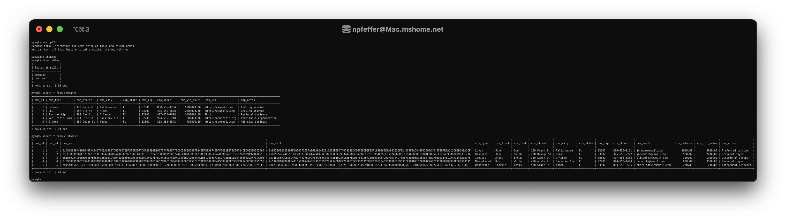
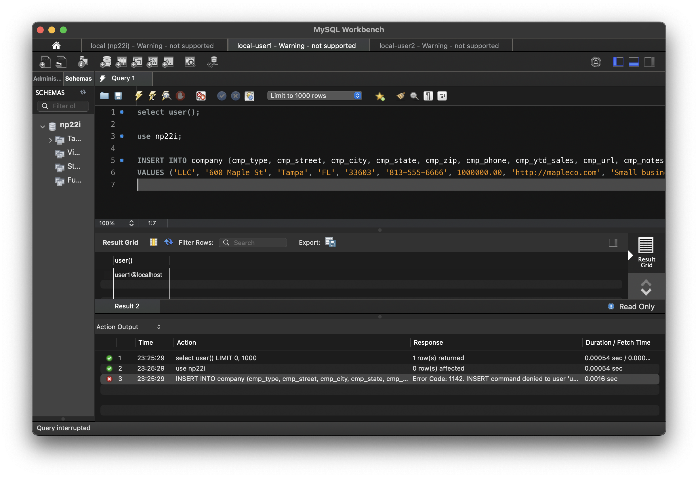
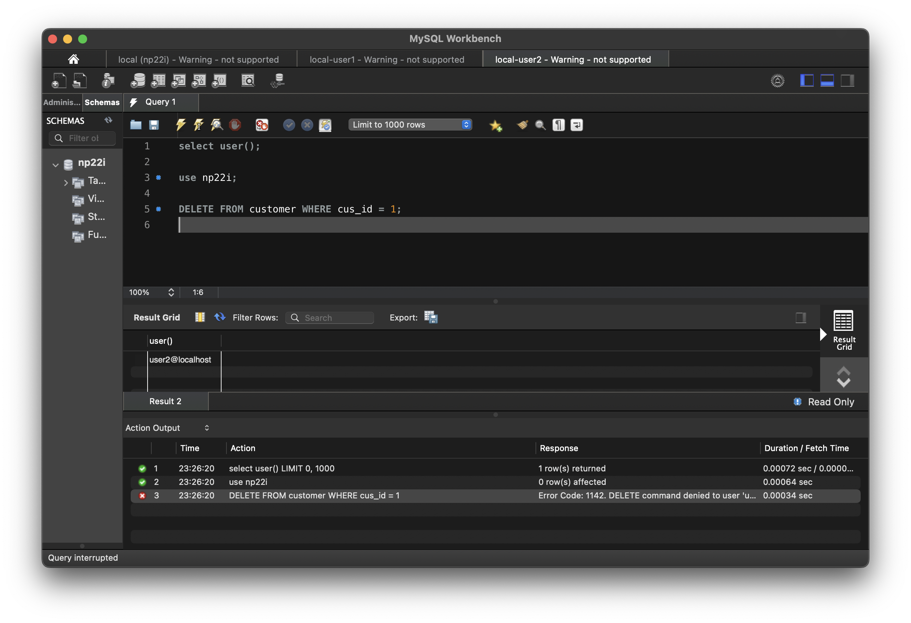
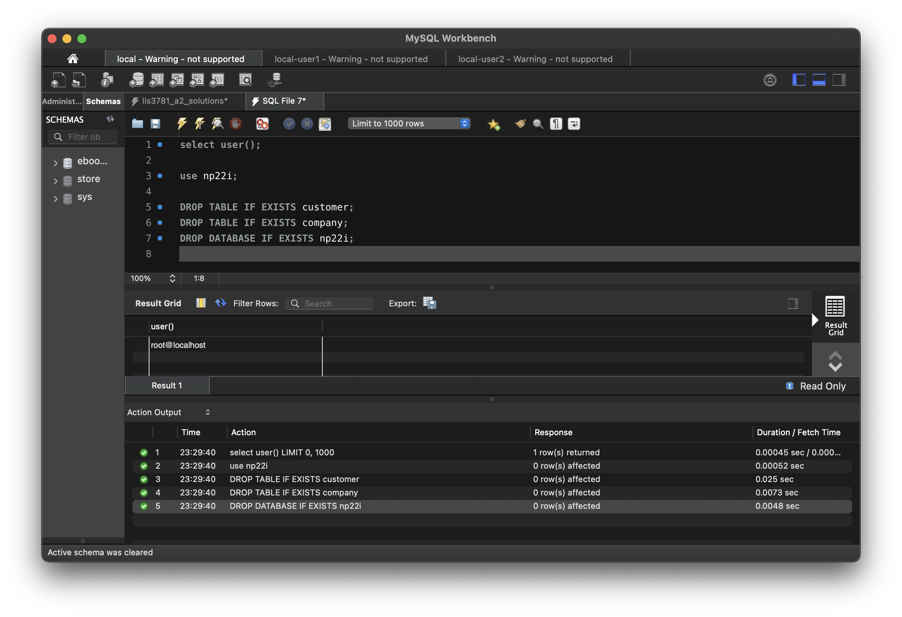

# LIS3781

## Nicholas Pfeffer

### A2 Requirements:

* Write and execute lis3781_a2_solutions.sql
* Forward-engineer to both local and remote MySql servers
* Create local users and define permissions
* Link lis3781_a2_solutions.sql with populated fields (5-per-table)

#### README.md file should include the following items:

* Screenshot of lis3781_a2_solutions.sql results
* Screenshot of grants (user1, user2)
* Screenshot of failed permission attempts (user1, user2)
* Linked lis3782_a1_solutions.sql with populated fields and create statements

#### Assignment Screenshots:

*Screenshot of lis3781_a2_solutions.sql results*:

*Screenshot of user queries*:

| User1 - Fail | User2 - Fail |
|------|------------|
|  |  |

*Screenshot of root cleanup queries*:

#### Assignment Files:

* [lis3781_a2_solutions.sql](./lis3781_a2_solutions.sql)