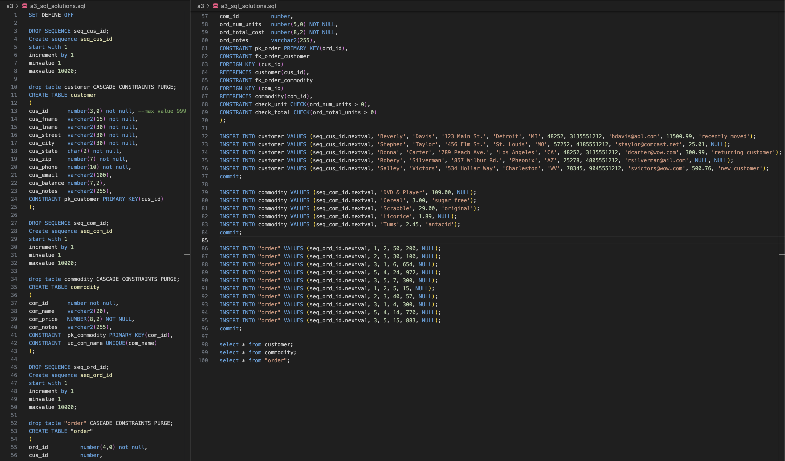
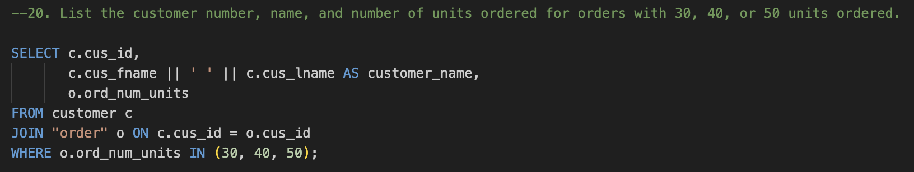

# LIS3781

## Nicholas Pfeffer

### A3 Requirements:

* Write and execute lis3781_a3_solutions.sql and required reports
* Forward-engineer to Oracle server
* Link lis3781_a3_solutions.sql

#### README.md file should include the following items:

* Screenshot of lis3781_a3_solutions.sql
* Screenshot of report #20 sql solution
* Linked lis3782_a3_solutions.sql with create statements

#### Assignment Screenshots:

*Screenshots of lis3781_a3_solutions.sql results and solution #20*:

#### Assignment Files:

* [lis3781_a3_solutions.sql](./lis3781_a3_solutions.sql)