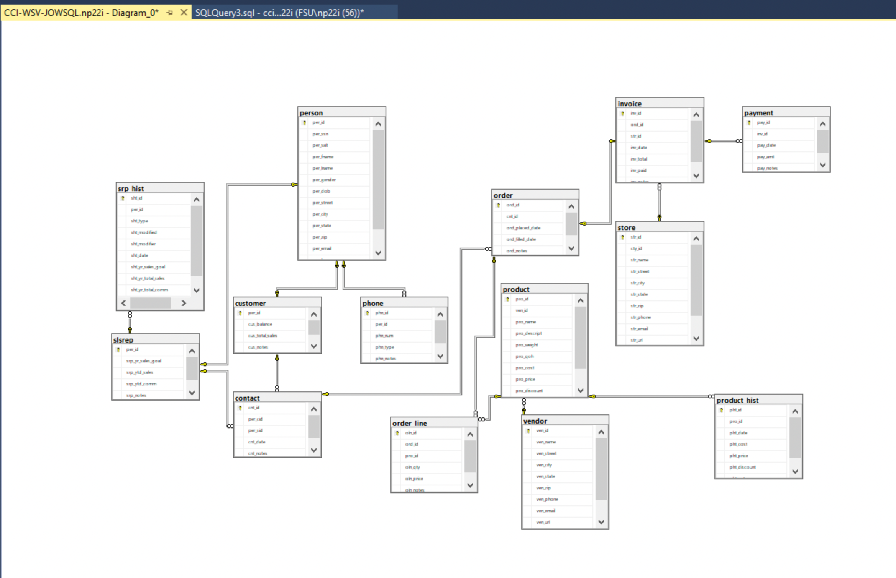
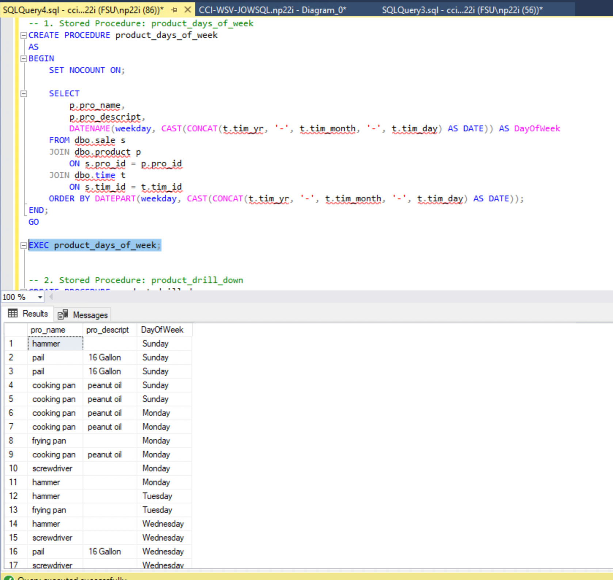

# LIS3781

## Nicholas Pfeffer

### A5 Requirements:

* Establish connection to MSSQL server
* Write and execute lis3781_a5_solutions.sql
* Create ERD/diagram for A5
* Link lis3781_a5_solutions.sql

#### README.md file should include the following items:

* Screenshot of lis3781_a5_solutions.sql ERD
* Screenshot of report for stored procedure
* Linked lis3782_a5_solutions.sql with create and insert statements

#### Assignment Screenshots:

*Screenshots of lis3781_a5_solutions.sql results and stored procedure*:

#### Assignment Files:

* [lis3781_a5_solutions.sql](./lis3781_a5_solutions.sql)