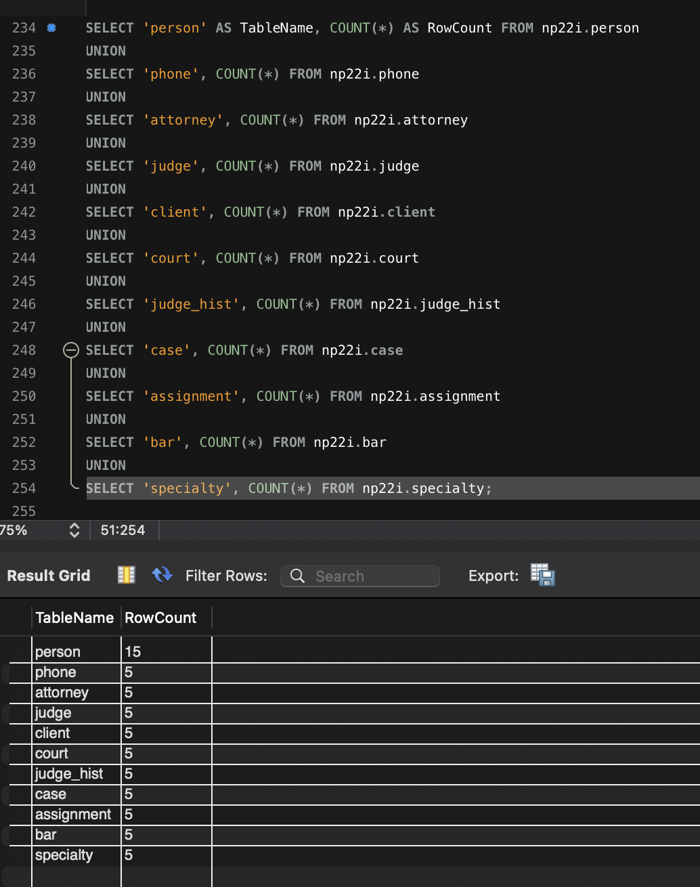

# LIS3781

## Nicholas Pfeffer

### Project 1 Requirements:

* Forward-engineer to the CCI (MySQL) server.
* Provide 15 records in the person table, and 5 records in 
* Submit the `lis3781_p1_solutions.sql` file containing:
  - All CREATE statements
  - All INSERT statements
  - At least one stored procedure, trigger, or view
* Include screenshots of:
  1. ERD (in MySQL Workbench, `.mwb` shown in Workbench)
  2. Number of tables (showing 11)
  3. Populated tables (showing that they each have data)
  4. At least one required report (SQL query + results)
* Provide Bitbucket or GitHub link to your `lis3781_p1_solutions.sql` file.

---

#### README.md file should include the following items:

* Screenshot of your ERD
* Screenshot of the number of tables (11)
* Screenshot of populated tables (11)
* Screenshot of at least one required report (query + results)
* Link to your `lis3781_p1_solutions.sql` file

---

#### Assignment Screenshots:

1. **ERD (`.mwb`) in MySQL Workbench**  
   

2. **Number of Tables (11) Confirmed**  
   

3. **Populated Tables**  
   

4. **Sample Report Execution**  
   

5. **Extra Credit Stored-Procedure**  
   

---

#### Assignment Files:

* [`lis3781_p1_solutions.sql`](./lis3781_p1_solutions.sql) – All CREATE statements, INSERTs, triggers, stored procedures, and extra credit event.
